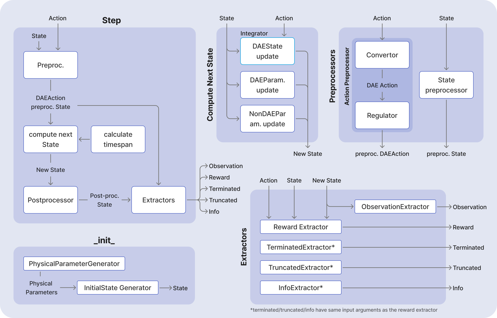
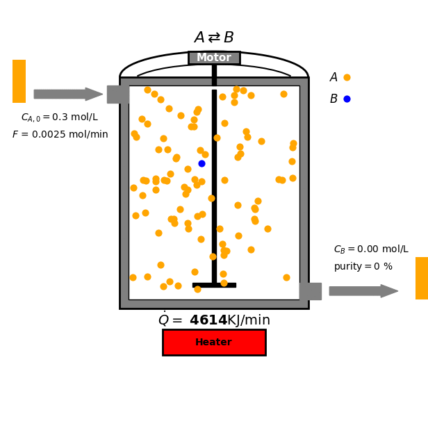
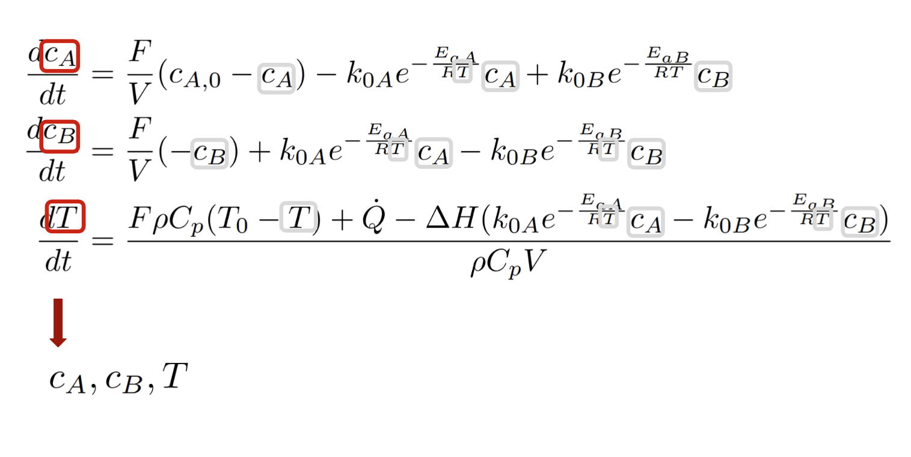
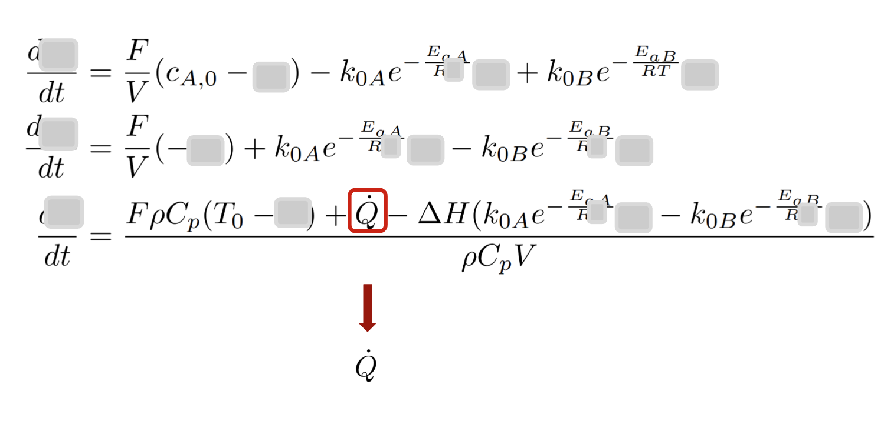
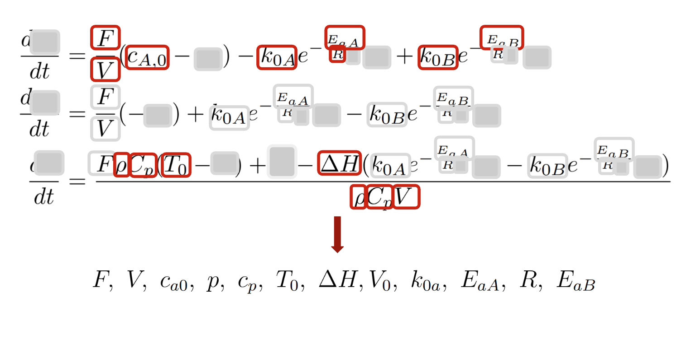
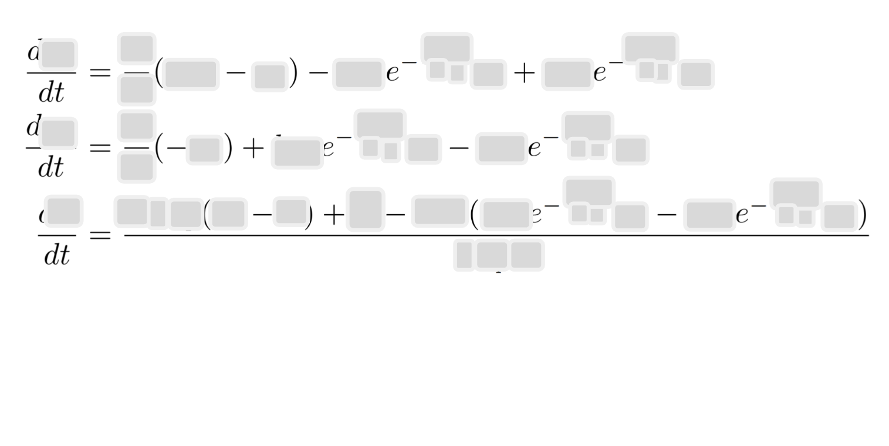

# Creating New Environments with DEgym: A Comprehensive Tutorial

This tutorial demonstrates how to create custom environments by subclassing from the DEgym framework's base `Environment` class. We'll use a [Continuous Stirred-Tank Reactor (CSTR)](https://en.wikipedia.org/wiki/Continuous_stirred-tank_reactor) example as a practical demonstration of the complete process.

## Table of Contents

- [Creating New Environments with DEgym: A Comprehensive Tutorial](#creating-new-environments-with-degym-a-comprehensive-tutorial)
  - [Table of Contents](#table-of-contents)
  - [Overview](#overview)
  - [DEgym Architecture Summary](#degym-architecture-summary)
  - [Building a New Environment: Complete Implementation Guide](#building-a-new-environment-complete-implementation-guide)
    - [Implementation Order Recommendation](#implementation-order-recommendation)
    - [List of classes with abstract methods](#list-of-classes-with-abstract-methods)
  - [Continuous Stirred-Tank Reactor](#continuous-stirred-tank-reactor)
    - [Goal and Constraints](#goal-and-constraints)
  - [Step-by-Step Implementation](#step-by-step-implementation)
    - [Step 1: Identify the DAE Formulation](#step-1-identify-the-dae-formulation)
      - [Step 1.1: Identifying `dae_state`](#step-11-identifying-dae_state)
      - [Step 1.2: Identifying `dae_action`](#step-12-identifying-dae_action)
      - [Step 1.3: Identifying `dae_params`](#step-13-identifying-dae_params)
    - [Step 2: Define the State](#step-2-define-the-state)
      - [2.1. dae\_state: `DAEState`](#21-dae_state-daestate)
      - [2.2. dae\_params: `DAEParameters`](#22-dae_params-daeparameters)
      - [2.3. non\_dae\_params: `NonDAEParameters`](#23-non_dae_params-nondaeparameters)
      - [Step 2.4: State Preprocessor](#step-24-state-preprocessor)
    - [Step 3: Defining Actions](#step-3-defining-actions)
      - [Step 3.1: Defining `DAEAction`](#step-31-defining-daeaction)
      - [Step 3.2: Defining `Action`](#step-32-defining-action)
      - [Step 3.3: Defining The Converter Between Action and DAEAction](#step-33-defining-the-converter-between-action-and-daeaction)
      - [Step 3.4: Define Action Regulator](#step-34-define-action-regulator)
      - [Step 3.5: Define Action Preprocessor](#step-35-define-action-preprocessor)
    - [Step 4: Define the Physical Parameters](#step-4-define-the-physical-parameters)
    - [Step 5: Define the Dynamics Function](#step-5-define-the-dynamics-function)
      - [Step 5.1a: Defining Dynamical Equations for Scipy Integrator](#step-51a-defining-dynamical-equations-for-scipy-integrator)
      - [Step 5.1b: Defining Dynamical Equations for DiffEqPy Integrator](#step-51b-defining-dynamical-equations-for-diffeqpy-integrator)
    - [Step 6: Defining Generators for PhysicalParameters and Initial State](#step-6-defining-generators-for-physicalparameters-and-initial-state)
      - [Step 6.1: Defining PhysicalParameters Generator](#step-61-defining-physicalparameters-generator)
      - [Step 6.2: Defining Initial State Generator](#step-62-defining-initial-state-generator)
    - [Step 7: Defining Extractors](#step-7-defining-extractors)
      - [Step 7.1: Observation Extractor](#step-71-observation-extractor)
      - [Steps 7.2-7.5: Defining Extractors for Reward, Terminated, Truncated, and Info](#steps-72-75-defining-extractors-for-reward-terminated-truncated-and-info)
    - [Step 8: Create Your Environment Class](#step-8-create-your-environment-class)
      - [Step 8.1: Calculation of time span](#step-81-calculation-of-time-span)
      - [Step 8.2: Computing Next DAEParameters and NonDAEParameters](#step-82-computing-next-daeparameters-and-nondaeparameters)
    - [Step 9: Create Environment Factory](#step-9-create-environment-factory)
  - [Conclusion](#conclusion)

## Overview

This tutorial demonstrates how to create custom environments using the DEgym framework, with a Continuous Stirred-Tank Reactor (CSTR) as a practical example.

> [!TIP]
> For a comprehensive overview of DEgym's core design principles, architecture, and philosophy, see [Inside DEgym: Core Design and Usage](degym_essentials.md).

## DEgym Architecture Summary

DEgym separates environment logic into two categories:

- **RL-related logic**: Common across all use cases (data flow, interfaces, `step` function structure).
- **Use-case-related logic**: Specific implementations (what actions mean, how states are defined, etc.).

The framework provides the RL-related infrastructure, while users implement only the use-case-specific components by inheriting from abstract classes. This approach enables both human developers and AI agents to create new environments systematically.

<p align="center">
  
</p>

> [!NOTE]
> For easier visualization, the above diagrams do not show the data classes which are passed between the components, nor do they indicate where the information is saved.

## Building a New Environment: Complete Implementation Guide

To create a custom environment in DEgym, you need to subclass the `Environment` class and implement all the required abstract classes. The `Environment.__init__()` method requires the following components:

```python
def __init__(
    self,
    physical_parameters_generator: PhysicalParametersGenerator,
    initial_state_generator: InitialStateGenerator,
    integrator: Integrator,
    action_preprocessor: ActionPreprocessor,
    state_preprocessor: StatePreprocessor,
    state_postprocessor: StatePostprocessor,
    observation_extractor: ObservationExtractor,
    reward_extractor: RewardExtractor,
    terminated_extractor: TerminatedExtractor,
    truncated_extractor: TruncatedExtractor,
    info_extractor: InfoExtractor,
    seed: int,
) -> None:
```
All of the above components (except the `Integrator` which is already implemented) are use-case dependent and need to be implemented. In the following we use walk through one such implementation for a continuous stirred tank reactor (CSTR). To achieve that we follow the following order.

### Implementation Order Recommendation

- **Step 1: Identify the DAE Formulation** - Identify `dae_state`, `dae_action`, `dae_params`.
- **Step 2: Define the State Components** - Implement state-related classes.
- **Step 3: Define Actions** - Implement action-related classes and processing.
- **Step 4: Define Physical Parameters** - Implement parameter classes.
- **Step 5: Define the Dynamics Function** - Implement system dynamics equations.
- **Step 6: Define Generators** - Implement parameter and initial state generators.
- **Step 7: Define Extractors** - Implement observation, reward, and termination extractors.
- **Step 8: Create Environment Class** - Implement your custom environment.
- **Step 9: Create Environment Factory** - Tie all components together with factory function.

### List of classes with abstract methods
By the end of this tutorial all the abstract methods listed below are implemented.

| Abstract Class | Abstract Methods | Purpose |
|---|---|---|
| **Environment** | `_calculate_time_span()`, `_return_next_dae_params()` , `_return_next_non_dae_params()` | Main environment interface |
| **DAEState** | `to_np_array()`, `from_np_array()` | DAE state variables |
| **DAEParameters** | `to_np_array()`, `from_np_array()` | DAE parameters |
| **NonDAEParameters** | `to_np_array()`, `from_np_array()` | Non-DAE parameters |
| **Action** | (marker class) | Semantic representation of raw step inputs |
| **DAEAction** | `to_np_array()`, `from_np_array()` | Control variables in DAE system |
| **ActionConvertor** | `_dae_action_to_action()`, `_action_to_dae_action()` | Convert between Action and DAE actions |
| **ActionRegulator** | `is_legal()`, `convert_to_legal_action()` | Enforce action constraints |
| **ActionPreprocessor** | `action_space` (property), `preprocess_action()` | Process actions before integration |
| **StatePreprocessor** | `preprocess_state()` | Process state before integration |
| **StatePostprocessor** | `postprocess_state()` | Process state after integration |
| **SystemDynamicsFn** | `__call__()` | Implement system dynamics equations |
| **PhysicalParameters** | (marker class) | Physical system parameters |
| **PhysicalParametersGenerator** | `generate()` | Generate physical parameters |
| **InitialStateGenerator** | `generate()` | Generate initial states |
| **Observation** | `to_np_array()` | RL observation interface |
| **ObservationExtractor** | `observation_space` (property), `extract_observation()` | Extract observations from state |
| **RewardExtractor** | `extract_reward()` | Extract rewards from state transitions |
| **TerminatedExtractor** | `extract_terminated()` | Determine episode termination |
| **TruncatedExtractor** | `extract_truncated()` | Determine episode truncation |
| **InfoExtractor** | `extract_info()` | Extract additional information |


## Continuous Stirred-Tank Reactor
In this tutorial we focus on a reversible reaction between reactant $A$ and product $B$ under ideal CSTR conditions:

$$\text{A} \overset{k_A}{\underset{k_B}{\rightleftharpoons}} \text{B}$$

<p align="center">
  
</p>

* Mass balance for $A$:

$$\frac{dc_A}{dt} = \frac{F}{V} (c_{A,0} - c_A) - k_A c_A + k_B c_B$$
* Mass balance for $B$:
$$\frac{dc_B}{dt} = \frac{F}{V} (-c_B) + k_A c_A - k_B c_B$$
* Energy balance equation:
$$\frac{dT}{dt} = \frac{F \rho C_p (T_0 - T) + \dot{Q} - \Delta H (k_A c_A - k_B c_B)}{\rho C_p V}$$

where
* $c_A$, $c_B$ are the concentrations of species A and B.
* $F$ is the flow rate.
* $V$ is the reactor volume.
* $k_A$, $k_B$ are the reaction rates: $k_A = k_{0A} e^{-\frac{E_{aA}}{RT}}$ and $k_B = k_{0B} e^{-\frac{E_{aB}}{RT}}$ with $k_{0\mathrm{X}}$ and $E_{a\mathrm{X}}$ being the pre-exponential factor and activation energy of $\mathrm{X}$, and $R$ is the ideal gas constant. * $k_A$, $k_B$ are the reaction rates: $k_A = k_{0A} e^{-\frac{E_{aA}}{RT}}$ and $k_B = k_{0B} e^{-\frac{E_{aB}}{RT}}$ with $k_{0\mathrm{X}}$ and $E_{a\mathrm{X}}$ being the pre-exponential factor and activation energy of $\mathrm{X}$, and $R$ is the ideal gas constant. These rates determine the ratio between $A$ and $B$ at a given temperature.
* $T$ is the reactor temperature.
* $\dot{Q}$ is the heat input.
* $\rho$ is the density of the liquid.
* $C_p$ is the heat capacity.
* $\Delta H$ is the heat of reaction.

### Goal and Constraints

The goal of the optimization is to maximize the production of species B by controlling the heat input $\dot{Q}$ to the reactor. This is subject to the following constraint: The heat input $\dot{Q}$ must be between 0 and $\dot{Q}_{\text{max}}$ (a positive constant).


## Step-by-Step Implementation

Developing a new reactor environment involves these key steps:

### Step 1: Identify the DAE Formulation

This is the most important step. One must first identify the ODEs/DAEs that govern the dynamics of the reactor and represent them in the following form:

```
d/dt dae_state = f(dae_state, dae_params, dae_action)
```
Where:
- **`dae_state`**: The variables that appear on the left-hand side of the DAE (the variables that are differentiated).
- **`dae_action`**: The actions, which are commonly the handles for controlling the process, as they appear in the DAE formulation.
- **`dae_params`**: The parameters/variables that are part of the calculation of `f` which are not `dae_state` or `dae_action`.

Let's do this for the CSTR example above. We start by writing the equations (where $k_A$ and $k_B$ are expressed explicitly):

$$\frac{dc_A}{dt} = \frac{F}{V} (c_{A,0} - c_A) - k_{0A} e^{-\frac{E_{aA}}{RT}} c_A + k_B c_B$$

$$\frac{dc_B}{dt} = \frac{F}{V} (-c_B) + k_{0A} e^{-\frac{E_{aA}}{RT}} c_A - k_{0B} e^{-\frac{E_{aB}}{RT}} c_B$$

$$\frac{dT}{dt} = \frac{F \rho C_p (T_0 - T) + \dot{Q} - \Delta H (k_{0A} e^{-\frac{E_{aA}}{RT}} c_A - k_{0B} e^{-\frac{E_{aB}}{RT}} c_B)}{\rho C_p V}$$

Now, the equations are ready to be used for identifying `dae_state`, `dae_action`, and `dae_params` in two steps. In each step:
* based on simple rules, we identify a group of variables from the equations and assign them to one of the variables above; and
* remove those identified variables from the equations.

To make this process clearer, we depict the outcome of the different step process visually. All the variables that are identified at each step are highlighted in red (for their first appearance and in gray for further appearances), and then covered after removing them.

#### Step 1.1: Identifying `dae_state`

**Rule**: All the variables appearing on the left-hand side of the equations, shown in red color (and highlighted in gray when they *also* appear on the right-hand side). In the case of ODEs, these are all the differentiated variables.

<p align="center">
  
</p>

In the example used here, $c_A$, $c_B$ and $T$ form `dae_state`. To create the DAE state for CSTR (`CSTRDAEState`) we inherit from the `DAEState` class and implement the abstract methods (as shown below).

> [!TIP]
> This inheritance is a procedure that we follow throughout creating a new environment: we inherit from `degym` abstract classes and implement the abstract components based on the concrete use case.

```python
class CSTRDAEState(DAEState):
    """
    DAEState class for CSTR.

    Attributes:
        c_a: Concentration of species A
        c_b: Concentration of species B
        T: Current temperature of system
    """
    c_a: float
    c_b: float
    T: float

    def to_np_array(self) -> NDArray:
        """Concatenate all the attributes."""
        return np.asarray(
            [
                self.c_a,
                self.c_b,
                self.T,
            ]
        )

    @classmethod
    def from_np_array(cls, np_array: NDArray) -> "DAEState":
        """Return a new instance of the class from a numpy array."""
        return CSTRDAEState(
            c_a=np_array[0],
            c_b=np_array[1],
            T=np_array[2],
        )
```

The abstract methods of `DAEState` (i.e., `from_np_array` and `to_np_array`) are used in the flow of information, e.g., for passing an instance of `DAEState` to the integrator, it is first converted to a numpy array.

For clarity, we remove these variables from the equations by covering them under a gray box.

#### Step 1.2: Identifying `dae_action`
**Rule**: All the variables related to actions/control as they appear in the DAE formulation

<p align="center">
  
</p>

```python
class CSTRDAEAction(DAEAction):
    """
    Action as it appears in the DAE system.

    Attributes:
        q_dot: Heat being applied to the system.
    """

    q_dot: float

    def to_np_array(self) -> NDArray[np.floating]:
        """Return the action as a numpy array."""
        return np.array([self.q_dot])

    @classmethod
    def from_np_array(cls, np_array: NDArray[np.floating]) -> "CSTRDAEAction":
        """
        Return a new instance of the class from a numpy array.

        Args:
            np_array: Numpy array with shape (1,).

        Returns:
            CSTRDAEAction: Instance of the class.

        Raises:
            ValueError: If the shape of the numpy array is not (1,).
        """
        if np_array.shape != (1,):
            raise ValueError(f"Expected shape (1,) but got {np_array.shape}")
        return CSTRDAEAction(q_dot=np_array[0])
```

Similar to variables identified in the previous step, we remove the current variables from the equations by covering them under a gray box.

#### Step 1.3: Identifying `dae_params`

**Rule**: Any other remaining variables belong to parameters.

<p align="center">
  
</p>

If, similar to the previous steps, we cover these variables, there would be no other variables left in the equations.

<p align="center">
  
</p>

The concrete implementation of `CSTRDAEParameters` can be found in the corresponding file.


> [!IMPORTANT]
> - `dae_state` is **not** necessarily the same as the state of the reactor. It represents only the variables that appear on the left-hand side of the DAE.
> - `dae_params` are **not** necessarily the parameters needed to configure  the environment (those provided in YAML files), although there could be overlap.
> - The state of the environment is represented by the `State` class which includes `dae_state`, `dae_params`, and `non_dae_params` (as explained below).

### Step 2: Define the State

After identifying the DAE, you need to implement a subclass of `State`. Let's clarify what `State` is and what it is not:

The `State` class represents the "internal" state of the environment. This internal state includes **all the variables/parameters required to fully describe the environment at any point in time**. In other words, the `State` has enough information to set the environment to any step in an episode.

More explicitly, the `State` has three parts:
- **`dae_state: DAEState`**: Variables that appear on the left-hand side of the DAE (See above).
- **`dae_params: DAEParameters`**: Parameters used in DAE calculations (See above).
- **`non_dae_params: NonDAEParameters`**: Parameters that are **not** part of the differential equations.

#### 2.1. dae_state: `DAEState`
Refer to [Step 1.1](#step-11-identifying-dae_state).
#### 2.2. dae_params: `DAEParameters`
Refer to [Step 1.2](#step-12-identifying-dae_action).

#### 2.3. non_dae_params: `NonDAEParameters`
The `non_dae_params` contains all the necessary parameters for configuring the environment which are not part of the DAE. For example:
- Parameters used for configuring constraints (e.g., maximum value of a variable or action).
- Parameters that appear indirectly in the DAE (e.g., variables used to calculate `dae_params`).

To identify these parameters, go through the description of the problem, collect all the parameters, and then remove the ones appearing in the DAE.

For the case of CSTR, the maximum heating capacity and the duration of one episode are such parameters:

```python
class CSTRNonDAEParameters(DAEParameters):
    """
    Non-DAE parameters for the CSTR problem.

    Attributes:
        q_max: Maximum heat that can be applied at each timestep.
        max_timestep: Number of minutes to run.
        timestep: Current timestep.
    """

    q_max: float
    max_timestep: int  # Number of minutes to run
    timestep: int = 0  # Current timestep

    def to_np_array(self) -> NDArray:
        """Concatenate all the attributes."""
        return np.asarray(
            [
                self.q_max,
                self.max_timestep,
                self.timestep,
            ]
        )

    @classmethod
    def from_np_array(cls, np_array: NDArray) -> "DAEParameters":
        """Return a new instance of the class from a numpy array."""
        return CSTRNonDAEParameters(
            q_max=np_array[0],
            max_timestep=np_array[1],
            timestep=np_array[2],
        )
```
#### Step 2.4: State Preprocessor
Within the `step` function, as the first computation, the state and the action are preprocessed. The prefix *pre-* here refers to before integrating the dynamical equations.

The preprocessing of the action is done by `ActionPreprocessor` (See "Defining Action Preprocessor" subsection below).

The preprocessing of the state is an identity operation in the case of CSTR, i.e., the state is used without processing. Therefore, the implementation of the `CSTRStatePreprocessor` is simply subclassing `StatePreprocessor` and implementing its abstract method with an identity operation.

```python
class CSTRStatePreprocessor(StatePreprocessor):  # noqa: D101
    def preprocess_state(self, state: CSTRState) -> CSTRState:
        """No preprocessing of the state is needed."""
        return state
```

### Step 3: Defining Actions

In DEgym, we distinguish three *representations* in the action processing pipeline:
1. **Raw step input**: The actual input passed to the `step()` function (e.g., numpy arrays, scalars, dicts).
2. **Action (semantic)**: An intermediate representation that gives semantic meaning to raw inputs.
3. **DAEAction**: The control variables as they appear in the differential equation formulation.

The flow is: Raw Step Input → Action (semantic) → DAEAction (physical parameters)

For example:
- Raw input: `0.8` passed to `step()` (a float between 0 and 1).
- Action: `CSTRAction(q_normalized=0.8)` (semantic meaning - normalized heat input).
- DAEAction: `CSTRDAEAction(q=4000.0)` (physical heat input that appears in differential equations).

#### Step 3.1: Defining `DAEAction`
To identify the DAE action, see [Step 1.2](#step-12-identifying-dae_action).

#### Step 3.2: Defining `Action`

The `Action` class provides semantic meaning to raw step inputs. It transforms raw numerical data into structured, interpretable representations before conversion to physical control parameters. In the case of CSTR, for example, we define this action to interpret a raw scalar as normalized heat input:

```python
@dataclass(frozen=True)
class CSTRAction(Action):
    """
    Action class for CSTR problem.

    The agent selects a continuous action in the range [0, 1],
    which relates to heat being applied in the range [0, Q_max].
    """
    q_normalized: float  # Normalized heat input [0, 1]
```

Note that the `Action` class serves as an intermediate semantic layer that makes control logic more interpretable and debuggable, while `DAEAction` contains the actual control variables used in differential equations.

#### Step 3.3: Defining The Converter Between Action and DAEAction
DEgym requires a converter between semantic actions and DAE control parameters. In the case of CSTR, this involves simple scaling from normalized to physical units. To write this converter, we inherit from the `ActionConvertor` class and implement the abstract methods:

```python
class CSTRActionConvertor(ActionConvertor):
    """
    Action convertor for the CSTR.
    """
    def _action_to_dae_action(self, action: CSTRAction, state: CSTRState) -> CSTRDAEAction:
        """Multiply the RL action by q_max to denormalize."""
        q = action.q_normalized * state.non_dae_params.q_max
        return CSTRDAEAction(q=q)

    def _dae_action_to_action(self, dae_action: CSTRDAEAction, state: CSTRState) -> CSTRAction:
        """Divide the RL action by q_max to normalize."""
        q_normalized = dae_action.q / state.non_dae_params.q_max
        return CSTRAction(q_normalized=q_normalized)
```

#### Step 3.4: Define Action Regulator
In case there are constraints on the actions, one can impose those constraints via `ActionRegulator`s. As these constraints are commonly expressed as business rules, in DEgym, the action regulators act on `DAEAction`. The abstract methods are `is_legal` and `convert_to_legal_action`. In this example, a valid (legal) action is a heat intensity between zero and the maximum allowed value (which is set in the config). The `convert_to_legal_action` method clips the actions to be in the valid range.

```python
class CSTRActionRegulator(ActionRegulator):
    """
    Action regulator for the CSTR problem.
    """
    def is_legal(
        self,
        dae_action: CSTRDAEAction,
        state: CSTRState,
    ) -> bool:
        """The action is legal if the heat stays within the bounds."""
        is_legal: bool = 0 <= dae_action.q <= state.non_dae_params.q_max
        return is_legal

    def convert_to_legal_action(self, dae_action: CSTRDAEAction, state: CSTRState) -> CSTRDAEAction:
        """If illegal action outside [0, q_max] then clamp it."""
        if dae_action.q <= 0:
            return CSTRDAEAction(q=0.0)
        if dae_action.q >= state.non_dae_params.q_max:
            return CSTRDAEAction(q=state.non_dae_params.q_max)
        return dae_action
```
#### Step 3.5: Define Action Preprocessor
`ActionPreprocessor` orchestrates the complete action processing pipeline that transforms raw step inputs into validated DAE control parameters. This is done by:
1. **Wrapping raw input**: Converting raw step input (arrays, scalars) into semantic Action objects.
2. **Semantic conversion**: Using `ActionConvertor` to transform Action to DAEAction.
3. **Constraint enforcement**: Applying `ActionRegulator` to ensure DAEAction compliance.


The abstract methods that need to be implemented are `action_space` (property) and `preprocess_action`.

```python
class CSTRActionPreprocessor(ActionPreprocessor):
    """Action preprocessor for the CSTR problem."""
    @property
    def action_space(self) -> gym.spaces.Box:
        """CSTR RL action space: normalized heat in [0, 1]"""
        return gym.spaces.Box(low=0.0, high=1.0, shape=(1,))

    def preprocess_action(self, action: float, state: CSTRState) -> CSTRDAEAction:
        """
        Preprocess a raw scalar action to validated DAEAction.

        Args:
            action: Raw scalar action from agent (normalized heat input).
            state: Current state of the environment.

        Returns:
            CSTRDAEAction: Preprocessed action for integration.
        """
        # Step 1: Wrap raw input into semantic Action
        semantic_action = CSTRAction(q_normalized=action)

        # Step 2: Convert to DAE parameters
        dae_action = self.action_convertor.action_to_dae_action(semantic_action, state)

        # Step 3: Apply constraints
        if self.action_regulator.is_legal(dae_action, state):
            return dae_action
        else:
            return self.action_regulator.convert_to_legal_action(dae_action, state)
```

### Step 4: Define the Physical Parameters

Physical parameters are all the parameters needed to calculate `dae_params` and `non_dae_params`. These are the parameters generated during the initialization of the environment (or its reset).

> [!NOTE]
> The set of physical parameters could have overlap with `dae_params` and `non_dae_params`, but they are not necessarily the same. For example, a categorical parameter could be the make/model of the reactor, from which volume is determined (and used in `dae_params` as $V$ appears in the dynamical equations). In the current example, this is not the case. The physical parameters are the result of the union of `dae_params` and `non_dae_params`.

```python
@dataclass(frozen=True)
class CSTRPhysicalParameters(PhysicalParameters):
    """
    Physical constants for the CSTR problem.

    Attributes:
        p: liquid density.
        c_a_0: Initial concentration of A.
        c_p: Heat capacity of the tank.
        e_a: Activation energy of A -> B.
        e_b : Activation energy of B -> A.
        F: Flow rate in and out of the reactor.
        dh: Heat of the reaction.
        k_0_a: Pre-exponential factor for A -> B.
        k_0_b: Pre-exponential factor for B -> A.
        R: Ideal gas constant.
        T_0: Initial temperature in the reactor.
        V: Tank volume.
        q_max: Max heat that can be applied at each timestep.
        max_timestep: Number of minutes to run.
    """
    p: float = 780  # kg/m³
    c_a_0: float = 0.3  # kmol/m³
    c_p: float = 3.25  # kJ/kgK
    e_a: float = 41570  # kJ / kmol
    e_b: float = 45727  # kJ / kmol
    F: float = 0.0025  # m³/min
    dh: float = 4157  # kJ / kmol
    k_0_a: float = 50_000  # min-1
    k_0_b: float = 100_000  # min-1
    R: float = 8.314  # kJ / kmol −K
    T_0: float = 300  # K
    V: float = 0.2  # m³
    q_max: float = 5000  # kJ/min
    max_timestep: int = 600 # mins

    def to_np_array(self) -> NDArray[np.floating]:
        """Concatenate all the attributes."""
        return np.asarray(list(asdict(self).values()))
```
The numerical values of the above physical parameters are derived from "Dynamic Economic Optimization of a Continuously Stirred Tank Reactor Using Reinforcement Learning," by D. Machalek, et al. 2020.

### Step 5: Define the Dynamics Function

The dynamics function calculates the derivative of the `dae_state` given the current state of the environment. This function is used in the integration of the DAE and should be implemented as a subclass of `DiffeqpySystemDynamicsFn` or `ScipySystemDynamicsFn`.

Note that this is the most manual step in the process and the most error-prone. One must be very careful in implementing the `__call__` function.

For both cases, one should implement the `__call__` function, in which the dynamical equations are implemented. The signature depends on the integrator (where signature variables are explained below):

**For ScipySystemDynamicsFn:**
```python
def __call__(
    state: NDArray[np.floating],
    parameters: NDArray[np.floating],
    action: NDArray[np.floating],
    time: float,
    ) -> NDArray[np.floating]:
```

**For DiffeqpySystemDynamicsFn:**
```python
def __call__(
    derivative: list[float],
    input_values: NDArray[np.floating],
    parameters: NDArray[np.floating],
    time: NDArray[np.floating],
) -> None:
```

#### Step 5.1a: Defining Dynamical Equations for Scipy Integrator
For the `scipy` integrator, the arguments to the `__call__` function are:
* `state` which corresponds exactly to `DAEState`.
* `parameters` which corresponds exactly to `DAEParameters`.
* `action` which is exactly `DAEAction`; and
* `time` which is the time as it appears in the dynamical equations (in the CSTR case there is no explicit time dependence).

These arguments are used to return the left-hand side of the dynamical equations, i.e., `d DAEState / dt` as a numpy array.

> [!NOTE]
> This split of arguments is in line with the logic of how parameters are grouped together in DEgym. To showcase that, in the following implementation, these arguments are converted to their counterpart DEgym classes at the beginning of the `__call__` function.

```python
class CSTRScipySystemDynamics(ScipySystemDynamicsFn):  # noqa: D101
    @staticmethod
    def __call__(
        state: NDArray[np.floating],
        parameters: NDArray[np.floating],
        action: NDArray[np.floating],
        time: float,
    ) -> NDArray[np.floating]:
        """
        Implement the dynamical model of CSTR.

        Differential equations:
            (1): dc_a/dt = (F / V) * (c_a0 − c_a)− k_a c_a  + k_b * c_b
            (2): dc_b/dt = (F / V) * (− c_b) + k_a c_a  - k_b * c_b
            (3): dT/dt = (F * p * c_p (T_0 - T) + q - dh * V
                            * (k_a * c_a - k_b * c_b)) / (p * c_p * V)

        With:
            k_a = k_0_a * exp(-e_a / rt)
            k_b = k_0_b * exp(-e_b / rt)
        """
        s = CSTRDAEState.from_np_array(state)  # dae state
        pm = CSTRDAEParameters.from_np_array(parameters)  # dae parameters
        a = CSTRDAEAction.from_np_array(action)  # dae action

        k_a = reaction_rate(k_0=pm.k_0_a, e=pm.E_a_A, r=pm.R, t=s.T)
        k_b = reaction_rate(k_0=pm.k_0_b, e=pm.E_a_B, r=pm.R, t=s.T)

        # Differential equations.
        delta_c_a = (pm.F / pm.V) * (pm.c_a_0 - s.c_a) - (k_a * s.c_a) + (k_b * s.c_b)  # d[A]/dt
        delta_c_b = (pm.F / pm.V) * (-s.c_b) + (k_a * s.c_a) - (k_b * s.c_b)  # d[B]/dt
        delta_T = (
            pm.F * pm.p * pm.c_p * (pm.T_0 - s.T) + a.q - pm.dh * pm.V * (k_a * s.c_a - k_b * s.c_b)
        ) / (pm.p * pm.c_p * pm.V)  # dT/dt

        return np.array([delta_c_a, delta_c_b, delta_T])
```
#### Step 5.1b: Defining Dynamical Equations for DiffEqPy Integrator

Unlike the scipy integrator, DiffEqPy requires a less straightforward signature for the `__call__` function. The arguments are:
* `derivative`: a list of floats which is `d DAEState / dt`. Note that this argument is set *in place*, i.e., at the end of the computation of time derivatives, the obtained values are placed in this list.
* `input_values` corresponds exactly to variables in `DAEState`.
* `parameters` contains *both* variables in `DAEParameters` and `DAEAction`, where the parameters appear first and the actions appear last.
* `time` is time as it explicitly appears in the dynamical equations (in the CSTR example there is no explicit time dependence).

> [!NOTE]
> One should be very careful about how to extract `DAEParameters` and `DAEAction` from `parameters`. For example, if the action space is changed, this split should be explicitly changed.

```python
class CSTRDiffeqpySystemDynamics(DiffeqpySystemDynamicsFn):  # noqa: D101
    # state has 3 values: {c_a, c_b, t}
    # We have differential equations for all 3 values => Identity matrix
    mass_matrix = np.eye(3, 3)

    @staticmethod
    def __call__(
        derivative: list[float],
        input_values: NDArray[np.floating],
        parameters: NDArray[np.floating],
        time: NDArray[np.floating],
    ) -> None:
        """
        Implement the dynamical model of CSTR.

        Differential equations:
            (1): dc_a/dt = (F / V) * (c_a0 − c_a)− k_a c_a  + k_b * c_b
            (2): dc_b/dt = (F / V) * (− c_b) + k_a c_a  - k_b * c_b
            (3): dT/dt = (F * p * c_p (T_0 - T) + q - dh * V
                            * (k_a * c_a - k_b * c_b)) / (p * c_p * V)

        With:
            k_a = k_0_a * exp(-e_a / rt)
            k_b = k_0_b * exp(-e_b / rt)
        """
        s = CSTRDAEState.from_np_array(input_values)  # dae state
        pm = CSTRDAEParameters.from_np_array(parameters[:-1])  # dae parameters
        a = CSTRDAEAction.from_np_array(parameters[-1:])  # dae action

        k_a = reaction_rate(k_0=pm.k_0_a, e=pm.E_a_A, r=pm.R, t=s.T)
        k_b = reaction_rate(k_0=pm.k_0_b, e=pm.E_a_B, r=pm.R, t=s.T)

        # Differential equations.
        derivative[0] = (
            (pm.F / pm.V) * (pm.c_a_0 - s.c_a) - (k_a * s.c_a) + (k_b * s.c_b)
        )  # d[A]/dt
        derivative[1] = (pm.F / pm.V) * (-s.c_b) + (k_a * s.c_a) - (k_b * s.c_b)  # d[B]/dt
        derivative[2] = (
            pm.F * pm.p * pm.c_p * (pm.T_0 - s.T) + a.q - pm.dh * pm.V * (k_a * s.c_a - k_b * s.c_b)
        ) / (pm.p * pm.c_p * pm.V)  # dT/dt

```

### Step 6: Defining Generators for PhysicalParameters and Initial State
DEgym requires two generators for instantiation and reset:
* A subclass of PhysicalParametersGenerator which generates an instance of `PhysicalParameters`. Having a generator instead of just using an instance of `PhysicalParameters` enables us to create (random) variation in parameters of the environment. For example, if a use case requires training an agent for controlling a reactor where the $\Delta H$ is coming from a random distribution, one can realize that with the generator.

* A subclass of `InitialStateGenerator` which generates an instance of `State` as the initial state of the environment. Similar to the physical parameter generator, a generator can set the environment in different initial states every time an instance of the environment is created or reset.

#### Step 6.1: Defining PhysicalParameters Generator
For the CSTR use case, similar to any concrete reactor, we create a subclass of `PhysicalParametersGenerator` and implement its abstract method `generate` with the following signature:
```python
class PhysicalParametersGenerator(ABC):
    """Generator for physical parameters of the system."""

    @abstractmethod
    def generate(self, rng: np.random.Generator) -> PhysicalParameters:
        """Generate a set of physical parameters describing an instantiation of the system."""
```
> [!NOTE]
> The logic with which the physical parameters are generated is irrelevant for DEgym. For example, in the CSTR case we implemented `CSTRPhysicalParametersGenerator` which returns an instance of `CSTRPhysicalParameters` where some of the parameters are generated randomly and some have fixed values. Whether a parameter has fixed values or it is derived from a distribution is configured by a config.

For details of the implementation refer to `physical_parameters.py` in `degym_tutorial/`.

#### Step 6.2: Defining Initial State Generator
To develop an initial state generator, one can subclass `InitialStateGenerator` and implement its only abstract method which is `generate`. Note that to generate an initial state one requires knowing the physical parameters of the system. Therefore, an instance of `PhysicalParameters` (or `CSTRPhysicalParameters` in the case of the CSTR example) is passed to the `generate` function.

```python
class CSTRInitialStateGenerator(InitialStateGenerator):
    """InitialStateGenerator class for the CSTR problem."""

    def generate(self, physical_parameters: CSTRPhysicalParameters) -> CSTRState:
        """Return the initial state given a set of physical parameters for the system."""
        dae_state = CSTRDAEState(
            c_a=physical_parameters.c_a_0,
            c_b=0.0,
            T=physical_parameters.T_0,
        )

        dae_params = CSTRDAEParameters(
            F=physical_parameters.F,
            V=physical_parameters.V,
            c_a_0=physical_parameters.c_a_0,
            p=physical_parameters.p,
            c_p=physical_parameters.c_p,
            T_0=physical_parameters.T_0,
            dh=physical_parameters.dh,
            k_0_a=physical_parameters.k_0_a,
            k_0_b=physical_parameters.k_0_b,
            E_a_A=physical_parameters.e_a,
            E_a_B=physical_parameters.e_b,
            R=physical_parameters.R,
        )
        non_dae_params = CSTRNonDAEParameters(
            q_max=physical_parameters.q_max,
            max_timestep=physical_parameters.max_timestep,
            timestep=0,
        )
        return CSTRState(dae_state=dae_state, dae_params=dae_params, non_dae_params=non_dae_params)

```

### Step 7: Defining Extractors

Extractors convert the internal state to the return values of the `step` function dictated by Gymnasium's convention:
(i) observation, (ii) reward, (iii) terminated, (iv) truncated, (v) info. In the following, we explain the observation extractor in detail and the other extractors are briefly described.

> [!NOTE]
> These extractors are called at the very end of the `step` function.

#### Step 7.1: Observation Extractor

The observation extractor converts the internal state to the observation that the RL agent receives. To implement this extractor:
* first we need to implement a class for observation by subclassing the `Observation` class and implementing its abstract method, i.e. `to_np_array`; and then
* subclass the `ObservationExtractor` class and implement its abstract method and property, i.e., `extract_observation` and `observation_space`.

```python
@dataclass(frozen=True)
class CSTRObservation(Observation):
    """Observation returned to the RL agent for CSTR."""
    normalized_c_a: float  # Normalized concentration of A
    normalized_c_b: float  # Normalized concentration of B
    normalized_temperature: float  # Normalized temperature

    def to_np_array(self) -> NDArray[np.floating]:
        """Convert observation to numpy array."""
        return np.array([self.normalized_c_a, self.normalized_c_b, self.normalized_temperature])

class CSTRObservationExtractor(ObservationExtractor):
    """Extract observations from CSTR state."""

    @property
    def observation_space(self) -> gym.spaces.Box:
        """Define the observation space for RL agents."""
        return gym.spaces.Box(
            low=np.array([0.0, 0.0, 0.0]),
            high=np.array([1.0, 1.0, 2.0]),
            shape=(3,),
            dtype=np.float32
        )

    def extract_observation(self, next_state: CSTRState) -> CSTRObservation:
        """Convert state to observation by normalizing values."""
        # Normalize concentrations by initial concentration
        c_a_normalized = next_state.dae_state.c_a / next_state.dae_params.c_a_0
        c_b_normalized = next_state.dae_state.c_b / next_state.dae_params.c_a_0

        # Normalize temperature by initial temperature
        t_normalized = next_state.dae_state.T / next_state.dae_params.T_0

        return CSTRObservation(
            normalized_c_a=c_a_normalized,
            normalized_c_b=c_b_normalized,
            normalized_temperature=t_normalized
        )
```
> [!NOTE]
> * The observation depends only on `next_state`.
> * `next_state` here refers to the state of the environment **after** the postprocessing (which comes after the application of action).

#### Steps 7.2-7.5: Defining Extractors for Reward, Terminated, Truncated, and Info
All the remaining extractors:
* are simpler than the observation extractor as their return types are basic Python types, i.e., `float`, `bool`, and `dict`; and
* they share the same list of arguments: `self, state: State, action: DAEAction, next_state: State`.

In their argument list:
* `state` is the `State` at the beginning of the `step` (i.e., before application of action).
* `action` is the action taken in the step.
* `next_state`: The state at the end of the `step` **after** the postprocessing (which comes after the application of action).

As an example here we show `CSTRRewardExtractor`:
```python
class CSTRRewardExtractor(RewardExtractor):  # noqa: D101
    def extract_reward(
        self, state: CSTRState, action: CSTRDAEAction, next_state: CSTRState
    ) -> float:
        """Immediate reward is the concentration of the product, c_B."""
        return float(next_state.dae_state.c_b)
```

### Step 8: Create Your Environment Class
In the `Environment` class of DEgym, there are also two abstract methods that should be implemented:
* `_calculate_time_span`: where one calculates the time span covered by the `step` function. This function is called inside the step function, before the integration. It is used for setting the beginning and end of the time integration for the current call to `step`. Note that this function enables us to have variable time spans across calls to the step function, which is a relevant feature for chemical/biological reactors.

* `_return_next_dae_params`: updates and returns the `dae_params`.
* `_return_next_non_dae_params`: updates and returns the `non_dae_params`.

> [!NOTE]
> Non-DAE Parameters can change with time. For example, the cost of energy which does not appear in chemical reactions might change with time; it has its own dynamics which require an update during the step for the given time span.

#### Step 8.1: Calculation of time span
In the CSTR environment we assume a fixed constant time span across all steps. In this case, the logic of the time span computation is straightforward:
```python
class CSTREnvironment(Environment):
    """
    Environment for the CSTR problem.
    """
    def _calculate_time_span(self) -> TimeSpan:
        """Calculate the time span of step function."""
        time_span = TimeSpan(
            start_time=self._current_time,
            end_time=self._current_time + self._integrator.config.action_duration,
        )
        return time_span
```
#### Step 8.2: Computing Next DAEParameters and NonDAEParameters
These methods allow us to have a time dependence for `dae_params` as well as `non_dae_params`.

```python
    def _return_next_dae_params(self, state: CSTRState) -> CSTRDAEParameters:
        """Return the current DAE parameters as the next DAE parameters."""
        return state.dae_params

    def _return_next_non_dae_params(self, state: CSTRState) -> CSTRNonDAEParameters:
        """Return the next non-DAE parameters by incrementing the timestep."""
        state.non_dae_params.timestep += 1
        return state.non_dae_params
```

### Step 9: Create Environment Factory

We are almost done! Here is a factory function to instantiate your CSTR environment from a config!

```python
def make_cstr_environment(env_config: dict) -> CSTREnvironment:  # pylint: disable=too-many-locals
    """
    Instantiate and return a CSTR environment.

    Args:
        a dict which includes all the configs of the environment.

    Returns:
        an environment.
    """
    physical_parameter_generator_config = CSTRPhysicalParametersGeneratorConfig(
        **env_config["physical_parameters"]
    )
    physical_parameters_generator = CSTRPhysicalParametersGenerator(
        config=physical_parameter_generator_config
    )

    # Prepare preprocessing classes
    action_regulator = CSTRActionRegulator()
    action_convertor = CSTRActionConvertor()
    action_preprocessor = CSTRActionPreprocessor(
        action_convertor=action_convertor, action_regulator=action_regulator
    )
    state_preprocessor = CSTRStatePreprocessor()

    # Prepare integrator
    if env_config["integrator"] == "diffeqpy":
        system_dynamics = CSTRDiffeqpySystemDynamics()
        integrator_config = DiffeqpyIntegratorConfig(**env_config["integrator_config"])
        integrator = DiffeqpyIntegrator(
            system_dynamics=system_dynamics, integrator_config=integrator_config
        )
    elif env_config["integrator"] == "scipy":
        system_dynamics = CSTRScipySystemDynamics()
        integrator_config = ScipyIntegratorConfig(**env_config["integrator_config"])
        integrator = ScipyIntegrator(
            system_dynamics=system_dynamics, integrator_config=integrator_config
        )
    else:
        raise NotImplementedError(f"Integrator {env_config['integrator']} not implemented")

    # Prepare extractors + state postprocessor
    observation_extractor = CSTRObservationExtractor()
    reward_extractor = CSTRRewardExtractor()
    terminated_extractor = CSTRTerminatedExtractor()
    truncated_extractor = CSTRTruncatedExtractor()
    info_extractor = CSTRInfoExtractor()
    state_postprocessor = CSTRStatePostprocessor()

    # Instantiate CSTR Environment
    env = CSTREnvironment(
        physical_parameters_generator=physical_parameters_generator,
        initial_state_generator=CSTRInitialStateGenerator(),
        integrator=integrator,
        action_preprocessor=action_preprocessor,
        state_preprocessor=state_preprocessor,
        state_postprocessor=state_postprocessor,
        observation_extractor=observation_extractor,
        reward_extractor=reward_extractor,
        terminated_extractor=terminated_extractor,
        truncated_extractor=truncated_extractor,
        info_extractor=info_extractor,
        seed=env_config["random_seed"],
    )

    return env
```

Having this factory, we can now easily create an environment and interact with it:

```python
import numpy as np
from make_env import make_cstr_environment

# For the reference of the physical parameters see:
# D. Machalek, T. Quah and K. M. Powell,
# "Dynamic Economic Optimization of a Continuously Stirred Tank Reactor Using Reinforcement Learning,"
# 2020 American Control Conference (ACC), Denver, CO, USA, 2020, pp. 2955-2960,
# doi: 10.23919/ACC45564.2020.9147706.
env_config = {
    "integrator": "scipy",
    "integrator_config": {
        "action_duration": 0.1,
        "method": "RK45",
        "rtol": 1e-6,
        "atol": 1e-8,
            },
            "random_seed": 0,
            "physical_parameters": {
                "fixed_values": {
                    "c_a_0": 0.3,
                    "c_p": 3.25,
                    "e_a": 41570,
                    "e_b": 45727,
                    "f": 0.0025,
                    "dh": 4157,
                    "k_0_a": 50_000,
                    "k_0_b": 100_000,
                    "r": 8.314,
                    "t_0": 300,
                    "v": 0.2,
                    "q_max": 5000,
                    "max_timestep": 100,
                },
                "sampled_values": {
                    "p": {"distribution": "choice", "choices": [780, 790], "size": 1}
                },
            },
        }

env = make_cstr_environment(env_config)
env.reset()
done = False
while not done:
    action = np.random.uniform(0.0, 1.0)  # Raw scalar: normalized heat input
    next_state, reward, terminated, truncated, info = env.step(action)
    done = terminated or truncated

```

## Conclusion

This tutorial has shown you how to create custom environments using the DEgym framework, following the methodology outlined in the official documentation. The key is to understand the separation between DAE components and RL components, and to implement each piece systematically starting with the DAE formulation.

The CSTR example demonstrates a complete, working implementation that you can use as a reference for your own environments.
